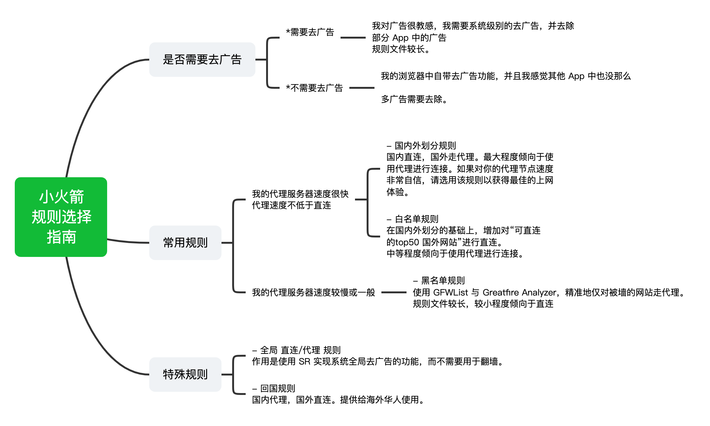

## 最完善的 iOS Shadowrocket规则

### 试更新公告

由于原作者 [h2y](https://github.com/h2y) 已停止维护 [Shadowrocket-ADBlock-Rules](https://github.com/h2y/Shadowrocket-ADBlock-Rules)，Shadowrocket 再无划分如此细致精美的规则。因此我决定用自己有限的能力和技术对该项目以个人的理解进行更新与维护。**所有规则都会在每天北京时间 8:00 更新发布。**

### 写在前面 —— 请保护好自己

谷歌中英文的搜索体验都优于百度，而刷美剧、ins 追星、去推特看看特朗普也都挺有意思。但是，随着看到的人和事越多，我越发想要在这里说一些话，告诫路过的各位：

**请务必保护好自己** 我们自认为打破了信息的壁垒，其实打破的是保护我们的屏障。因为外网真的存在很多误导性言论，来自各个利益集团对中国网民疯狂洗脑，他们往往还喜欢以平等自由等旗号自称，但仔细想想真的是这样吗？我只知道美国是最善于运用舆论的国家，会结合大数据潜移默化地改变你的观念。如果大家在上网过程中不经意看到了某些观点，务必保留自己独立思考的能力，如果你是一个容易被带偏的人，则建议回到屏障之中。

本规则只提供给大家用于更便捷地学习和工作。如果你是对上述观点持反对意见的极端政治人士，或者已被洗脑，请立即离开，本项目不对你开放。

------------------------------------------------------

这里是一系列好用的Shadowrocket规则，针对 [Shadowrocket](https://liguangming.com/Shadowrocket) 开发，支持广告过滤。规则定义了哪些网站可以直连，哪些必须走代理，规则是一个纯文本文件，无法提供魔法上网功能。使用 Python 按照一定的规则和模板定期自动生成，并且使用开源的力量，集众人之力逐渐完善。

**正在使用手机浏览本页面的用户 [请点击这里](https://tonylawx.github.io/Shadowrocket-ADBlock-Rules-Forever) ，查看完整的说明文档。**

**本规则具有以下特点：**

- 黑名单由最新版 [GFWList](https://github.com/gfwlist/gfwlist) 自动转换；
- 加入 [Greatfire Analyzer](https://github.com/Loyalsoldier/cn-blocked-domain) 检测到的屏蔽域名；
- 自动转换最新版本的 `EasyList`, `Eaylist China`, `Peter Lowe 广告和隐私跟踪域名`，`乘风规则` 为 SR 规则，全面去除广告且去除重复；
- 包括自定义的广告过滤规则，针对 iOS 端的网页广告、App 广告和视频广告；
- 提供多个规则文件供大家自由选择或者自由切换使用；
- 专门针对 ShadowRocket 开发，可以保证与 SR 的兼容性；
- 将 [Apple及其CDN域名](https://raw.githubusercontent.com/felixonmars/dnsmasq-china-list/master/apple.china.conf) 进行优化；
- 方便的快捷指令与自动化联动，每天自动更新规则；
- 增加使用代理组的懒人配置；
- 由于世界排名 top 500 网站列表已无法通过无账户/免费方式取得，故原来的 top500 检测方法失效。我已根据旧的 top500 榜单重构了新的 top500 网站连接情况表。**同时，希望大家可以帮助 pull requests 一份最新的 top500 榜单: [格式](https://github.com/Johnshall/Shadowrocket-ADBlock-Rules-Forever/blob/build/factory/resultant/top500_manual.list)**
- **所有发布的规则都会在每天北京时间 8:00 更新发布**


## 规则列表



规则 | 规定代理的网站 | 规定直连的网站 
--- | ----------- | ------------- 
[黑名单规则 + 去广告](#黑名单过滤--广告) |  被墙的网站（GFWList） | 正常的网站 
[黑名单规则](#黑名单过滤) |   |  
[白名单规则 + 去广告](#白名单过滤--广告) | 其他网站 | top500 网站中可直连的网站、中国网站 
[白名单规则](#白名单过滤) |   |  
[国内外划分 + 去广告](#国内外划分--广告) |  国外网站 | 中国网站
[国内外划分](#国内外划分) |   |  
[全局直连 + 去广告](#直连去广告) | / | 全部
[全局代理 + 去广告](#代理去广告) |  全部 | /
[回国规则 + 去广告](#回国规则--广告) | 中国网站 | 国外网站 
[回国规则](#回国规则) |   |  
[仅去广告规则](#仅去广告规则) |   |  
[懒人配置](#懒人配置) | 国外网站 | 国内网站  
[懒人配置（含策略组）](#懒人配置-含策略组) | 国外网站 | 国内网站  

- 以上所有规则，局域网内请求均直连。
- 可以下载多个规则切换使用。

## 规则使用方法

方法一：用 Safari 或 ShadowRocket 扫描二维码即可。  
方法二：在 ShadowRocket 应用中，进入 [配置] 页面，点击右上角加号，将规则文件地址粘贴到 url 处，点击“下载”即可。

最好让 ShadowRocket 断开并重新连接一次，以确保新的规则文件生效。 

## 如何自动更新
步骤一：安装[捷径](https://www.icloud.com/shortcuts/20bd590bc99e4ef0a157d2fe6e8c273d)，并填写规则文件地址；  
步骤二：打开“快捷指令”下方的“自动化”，轻击右上角加号，点击“创建个人自动化”，选择“特定时间”，设定时间为 8:05 或更晚的时间（规则生成需要一定时间），点击下一步，点击添加操作，选择 APP 栏，找到快捷指令，选择“运行快捷指令”，点击浅色“快捷指令”，选择“Shadowrocket 规则自动更新”，点击下一步，关闭运行前询问（可选），点击完成即可。

如果出现无法正常跳转 Safari 对 google.cn 的请求的情况，请在每次更新后点击规则后方的ℹ️，点击 HTTPS 解密，将 HTTPS 解密关闭，返回，再开启，即可正常跳转。

## 一些推荐的网站

**[IP111](http://ip111.cn/)**

这是一个很棒的 IP 查询网站，支持同时查询你的境内境外 IP，以及谷歌 IP。

**[hzy的博客](https://hzy.pw/)**

我是一名大学生，沉迷技术无法自拔。这是我的个人博客，会分享一些有趣的东西和自己的观点，欢迎来逛逛~

**[DuckSoft的博客](https://www.ducksoft.site/)**

INTP | Jack of all trades | I use Arch BTW

**[Blog](https://diazepam.cc/)**

一个喜欢生命和阳光的孩子。


## 常见问题

- **上千行的代理规则，会对上网速度产生影响吗？**

> 不会的。
>
> 我之前也认为这是一个每次网络数据包经过都会执行一次的规则文件，逐行匹配规则，所以需要尽可能精简。但后来和 SR 作者交流后发现这是一个误区，SR 在每次加载规则时都会生成一棵搜索树，可以理解为对主机名从后往前的有限状态机 DFA，并不是逐行匹配，并且对每次的匹配结果还有个哈希缓存。
>
> 换句话说，2000 行的规则和 50 行的规则在 SR 中均为同一量级的时间复杂度 O(1)。


- **你提供了这么多规则，如何选择适合我的？**

> 最常用的规则是黑名单和白名单。区别在于对待 `未知网站` 的不同处理方式，黑名单默认直连，而白名单则默认使用代理。如果你选择恐惧症爆发，那就两个都下载好了，黑白名单切换使用，天下无忧。

- **你提供了这么多规则，却没有我想要的 o(>.<)o**

> 有任何建议或疑问，[请联系我](#问题反馈)。

- **广告过滤不完全？**

> 该规则并不保证 100% 过滤所有的广告，尤其是视频广告，与网页广告不同的是，优酷等 App 每次升级都有可能更换一次广告策略，因此难以保证其广告屏蔽的实时有效性。而油管广告则不能通过简单的 url 匹配实现完全去广告。

- **外区 Apple Podcasts 无法正常加载** (感谢 [@jesuiseric](https://t.me/jesuiseric))

> 请将 `podcasts.apple.com`、`bookkeeper.itunes.apple.com`、`play.itunes.apple.com`、`xp.apple.com` 加入代理，详见 [#214](https://github.com/DivineEngine/Profiles/issues/214)

- **无法正常跳转 Safari 对 google.cn 的请求**

> 轻击配置 -> 轻击本地文件中正在使用的规则文件后的ℹ️ -> HTTPS 解密 -> 将右上角开关启动 -> 安装证书 -> 允许 -> 打开系统设置 -> 已下载描述文件 -> 安装 -> 输入密码 -> 安装 -> 通用 -> 关于本机 -> 证书信任设置 -> 对刚刚安装的根证书完全信任 即可正常跳转。

## 问题反馈

任何问题欢迎在 [Issues](https://github.com/Johnshall/Shadowrocket-ADBlock-Rules-Forever/issues) 中反馈。

你的反馈会让此规则变得更加完美。

**如何贡献代码？**

通常的情况下，对 [factory 目录](https://github.com/Johnshall/Shadowrocket-ADBlock-Rules-Forever/tree/build/factory) 下的若干个 `manual_*.txt` 文件做对应修改即可。**Pull requests 请发送至 build 分支。**

---

## 如何定制属于你自己的规则（Fork 自用版）

想在上游规则基础上加入自己的分流/拦截规则，并每天自动构建，按下面的步骤来。

### 第一步：Fork 仓库

1. 点击本仓库右上角 **Fork**；
2. **务必取消勾选 `Copy the release branch only`**，否则你拿不到带构建脚本的 `build` 分支；
3. Fork 完成后，进入你自己的仓库（形如 `你的用户名/Shadowrocket-ADBlock-Rules-Forever`）。

### 第二步：把默认分支设为 `build`

GitHub 只会到**默认分支**里去找定时任务（workflow）。Fork 出来的默认分支通常是 `release`（里面没有构建脚本），所以必须改：

> 你的仓库 → **Settings** → **General** → **Default branch** → 改成 `build` → Update。

> ⚠️ 这一步不做，下面的定时构建永远不会触发。

### 第三步：给 workflow 写权限

Fork 仓库默认给 Actions 的权限是**只读**，会导致构建最后一步把成品 push 回仓库时失败（403）。

> 你的仓库 → **Settings** → **Actions** → **General** → 滚到底部 *Workflow permissions* → 选 **Read and write permissions** → Save。

### 第四步：启用 Actions（fork 必做的一次性操作）

GitHub 出于安全考虑，fork 仓库的 workflow 默认**不会自动运行**，需要你手动确认一次：

1. 进入你的仓库 → **Actions** 标签页；
2. 会看到黄色横幅 *"Workflows aren't being run on this forked repository"*；
3. 点击绿色按钮 **`I understand my workflows, go ahead and enable them`**；
4. （此时 workflow 仍是 `disabled_fork` 状态）再点左侧 *Build Shadowrocket Rules* → 右上角 **⋯** → **Enable workflow**。

> 完成后，Actions 页面能看到 *Build Shadowrocket Rules* 处于 active 状态。

### 第五步：添加你自己的规则

这是最核心的一步。编辑 [`factory/`](https://github.com/Johnshall/Shadowrocket-ADBlock-Rules-Forever/tree/build/factory) 目录下的 `manual_*.txt` 文件，把规则追加进去即可（可以直接在网页上编辑，也可以 clone 到本地改）。**不需要写规则类型前缀，构建脚本会自动判断。**

| 文件 | 规则会被应用为 | 适合放什么 |
| --- | --- | --- |
| `manual_reject.txt` | `REJECT`（拦截） | 广告、追踪、想屏蔽的域名 |
| `manual_direct.txt` | `DIRECT`（直连） | 国内网站、公司内网、想直连的 App |
| `manual_proxy.txt` | `Proxy`（代理） | 被墙的网站、必须走代理才能用的 App |
| `manual_gemini.txt` | `Gemini`（策略组） | Google AI 的 API 接口（Gemini API、Antigravity、AI Studio），走名称含 "Gemini" 的专线节点 |
| `manual_gfwlist.txt` | `Proxy`（代理） | 追加到 GFWList 黑名单里 |
| `manual_gfwlist_excludes.txt` | （从黑名单排除） | 想从 GFWList 里移除的域名 |

**关于 `Gemini` 策略组**（所有含代理规则的配置均已内置）：

- Google 对 AI 接口（`generativelanguage.googleapis.com`、Antigravity 的 `daily-cloudcode-pa.googleapis.com` 等）的出口 IP 风控很严，普通节点常被拒；而**网页版** `gemini.google.com` 恰恰相反，家宽类普通节点没问题、美国机房 IP 反而容易被风控。因此 API 域名放 `manual_gemini.txt` 走专用组，网页版留在 `manual_proxy.txt` 走普通代理。
- 策略组定义为 `url-test` + `policy-regex-filter=Gemini`：自动从你的订阅里筛出名称含 "Gemini" 的节点并选延迟最低的，**无需手动干预**。机场没有此类节点时，可在 Shadowrocket → 配置 → ℹ️ → 代理分组 中自行调整该组的筛选正则（改成 `美国|US` 等）。

**书写格式（极简，脚本会自动识别）：**

```
# 以 # 开头是注释，方便分组
example.com            # 纯域名 → 自动变 DOMAIN-SUFFIX,example.com
1.2.3.4                # IPv4 → 自动补成 IP-CIDR,1.2.3.4/32
2001:db8::1            # IPv6 → 自动补成 IP-CIDR,2001:db8::1/128
google                 # 纯字母关键字 → 自动变 DOMAIN-KEYWORD,google
```

改完提交（commit 到 `build` 分支）。因为 workflow 监听了 `build` 分支的 push，**只要不是改 `.md` 或 `LICENSE`，提交后会自动触发一次构建**。

### 第六步：手动触发一次构建验证

你的仓库 → **Actions** → *Build Shadowrocket Rules* → **Run workflow** → 选 `build` 分支 → 运行。等 1～2 分钟跑完变绿，说明你的规则已经生成到 `.conf` 文件里了。

### 第七步：在 Shadowrocket 里导入你自己的规则

成品在 `build` 分支根目录，把订阅地址里的 `Johnshall` 换成你的用户名即可：

```
https://raw.githubusercontent.com/你的用户名/Shadowrocket-ADBlock-Rules-Forever/build/sr_adb.conf
```

国内访问 `raw.githubusercontent.com` 偶尔慢，可改用 jsDelivr 加速：

```
https://cdn.jsdelivr.net/gh/你的用户名/Shadowrocket-ADBlock-Rules-Forever@build/sr_adb.conf
```

> 💡 **选哪个 .conf？** 不同配置文件分流策略不同，你的自定义规则会按类型进入相应文件：
> - `manual_proxy`（你加的代理规则）→ 进 `sr_adb`、`sr_cnip_ad`、`sr_top500_banlist_ad`、`sr_top500_whitelist_ad` 等白名单/黑名单类配置；
> - `manual_direct`（你加的直连规则）→ 进 `sr_adb`、`sr_top500_whitelist*`；
> - `manual_reject`（你加的拦截规则）→ 几乎所有带广告过滤的配置。
>
> **推荐用 `sr_adb.conf`**（白名单 + 拦广告），自定义的代理和直连规则都在里面。

Shadowrocket → 配置 → 右上角 `+` → 粘贴上面的 URL → 类型选 **Conf** → 下载 → 设为当前配置。

### 第八步（可选）：直接扫码导入 —— 二维码是自动生成的

本仓库的构建流程**已经内置了二维码自动生成**：每次构建完成后，会对每个 `.conf` 规则文件生成一张订阅二维码 PNG，覆盖到 `figure/` 目录，并随构建一起提交。**这意味着你 Fork 之后，README 里那些二维码扫出来的就是你自己的规则地址，不用任何手动处理。**

**工作原理：**

构建流程里有一步 `Generate QR codes & update README URLs`（由 [`factory/generate_qr.py`](https://github.com/Johnshall/Shadowrocket-ADBlock-Rules-Forever/tree/build/factory/generate_qr.py) 完成），它会做两件事：

1. **生成二维码**：对下列 13 个规则文件，各生成一张二维码 PNG，编码的订阅地址形如 `https://raw.githubusercontent.com/{你的用户名}/{仓库名}/build/{规则名}.conf`。其中 `{你的用户名}` 和 `{仓库名}` 是构建时从当前仓库**自动读取**的，所以 Fork 者无需改任何代码，二维码天然指向自己的仓库。

   | 二维码文件 | 对应规则 | 用途 |
   | --- | --- | --- |
   | `figure/sr_top500_banlist_ad.png` | 黑名单 + 去广告 | 被墙网站走代理 |
   | `figure/sr_top500_whitelist_ad.png` | 白名单 + 去广告 | top500 直连、其余代理 |
   | `figure/sr_cnip_ad.png` | 国内外划分 + 去广告 | 中国直连、外国代理 |
   | `figure/sr_direct_banad.png` | 全局直连 + 去广告 | 当全局去广告工具 |
   | `figure/sr_proxy_banad.png` | 全局代理 + 去广告 | 全局翻墙 + 去广告 |
   | `figure/sr_backcn_ad.png` | 回国规则 + 去广告 | 海外华侨回国用 |
   | `figure/sr_ad_only.png` | 仅去广告 | 与其它规则联用 |
   | `figure/lazy.png` / `figure/lazy_group.png` | 懒人配置 | 开箱即用 |
   | 另 4 个（无 `_ad` 后缀） | 同上但不带广告过滤 | 浏览器已自带去广告时用 |

   > `figure/guide.png`（规则选择指南示意图）和 `sr_adb.conf` 不会被自动处理——前者是说明图不是二维码，后者没有对应的 README 章节。

2. **替换 README 里的地址**：把 README 中所有原作者的 `johnshall.github.io/Shadowrocket-ADBlock-Rules-Forever` 链接，替换成你自己的 `你的用户名.github.io/仓库名`。同时把二维码图片链接从绝对地址改成相对路径（`figure/xxx.png`），这样别人看你的 README 时，点规则地址、扫二维码都是指向**你**的仓库。

**怎么扫码导入：**

- **方式一（推荐）**：打开你 Fork 仓库的 README 页面（`https://github.com/你的用户名/Shadowrocket-ADBlock-Rules-Forever`），滚到对应规则章节，直接用 Shadowrocket 扫描那张二维码。
- **方式二**：单独打开某张二维码图片，例如：
  ```
  https://github.com/你的用户名/Shadowrocket-ADBlock-Rules-Forever/raw/build/figure/sr_ad_only.png
  ```
  手机显示这张图，再用 Shadowrocket 扫码。

> 💡 二维码里编码的是 `raw.githubusercontent.com` 直链（不依赖 GitHub Pages，永远可用）。每次构建后二维码内容会跟着更新——但因为你的订阅地址是固定的，**Shadowrocket 里只需配置/扫码一次，以后每次构建自动刷新内容**，无需重新导入。

> ⚠️ **关于 GitHub Pages**：替换后的 README 规则地址用的是 `你的用户名.github.io/仓库名` 形式。如果你没有在仓库 Settings → Pages 里开启 Pages 服务，这个文字地址会 404；但这**不影响扫码导入**（二维码用的是 raw 直链）。需要文字链接也可点的话，去 Settings → Pages 把 Source 设为 `build` 分支即可。

### 日常维护

- **每天自动构建**：北京时间早 7 点自动跑一次，同步最新的上游广告/分流源，你的规则会一直保留。
- **想再加规则**：继续编辑 `manual_*.txt` 并提交即可，无需做别的。
- **想同步上游的改进**：你的仓库首页点 **Sync fork**，或在本地：
  ```bash
  git remote add upstream https://github.com/Johnshall/Shadowrocket-ADBlock-Rules-Forever.git
  git fetch upstream
  git merge upstream/build
  git push
  ```
  你的 `manual_*.txt` 改动不会丢（除非上游改了同一行，手动解决冲突即可）。

### 排错速查

| 现象 | 原因 / 解决 |
| --- | --- |
| Actions 里根本没有 *Build Shadowrocket Rules* | 默认分支不是 `build`（第二步），或没启用 Actions（第四步） |
| workflow 状态是 `disabled_fork` | 第四步没做完，去 Actions 页手动 enable |
| 构建在 `Deploy` 步骤报 403 / Permission denied | 第三步没做，Workflow 权限是只读 |
| 构建在 `Generate QR codes` 步骤失败 | `requirements.txt` 里的 `qrcode`/`pillow` 没装上；该步骤失败不影响规则本身，仅二维码不更新，可重跑 workflow |
| 规则没出现在某个 `.conf` 里 | 该配置文件本就不包含对应类型，换 `sr_adb.conf`（见第七步提示） |
| 扫码后地址仍指向原作者 `Johnshall` | 那是旧的二维码缓存；确认构建跑过 `Generate QR codes` 步骤，刷新图片后再扫 |
| README 里规则地址文字链接 404 | 用的是 `你的用户名.github.io` 形式，需在 Settings → Pages 开启 Pages 服务（扫码导入不受影响） |


## 捐助

本项目不接受任何形式的捐助，因为自由地上网本来就是大家的权利，没有必要为此付出更多的代价。

但是，作为一个翻墙规则，不可避免的会对网站有所遗漏，需要大家来共同完善，当发现不好用的地方时，请打开 SR 的日志功能，检查一下是哪一个被墙的域名走了直连，或者是哪一个可以直连的域名走了代理。

将需要修改的信息反馈给我，大家的努力会让这个规则越来越完善！


----------------------------------------

## 黑名单过滤 + 广告

黑名单中包含了境外网站中无法访问的那些，对不确定的网站则默认直连。

- 代理：被墙的网站（GFWList）
- 直连：正常的网站
- 包含广告过滤

规则地址：<https://tonylawx.github.io/Shadowrocket-ADBlock-Rules-Forever/sr_top500_banlist_ad.conf>


## 白名单过滤 + 广告

白名单中包含了境外网站中可以访问的那些，对不确定的网站则默认代理。

- 直连：top500 网站中可直连的境外网站、中国网站
- 代理：默认代理其余的所有境外网站
- 包含广告过滤

规则地址：<https://tonylawx.github.io/Shadowrocket-ADBlock-Rules-Forever/sr_top500_whitelist_ad.conf>


## 黑名单过滤

现在很多浏览器都自带了广告过滤功能，而广告过滤的规则其实较为臃肿，如果你不需要全局地过滤 App 内置广告和视频广告，可以选择这个不带广告过滤的版本。

- 代理：被墙的网站（GFWList）
- 直连：正常的网站
- 不包含广告过滤

规则地址：<https://tonylawx.github.io/Shadowrocket-ADBlock-Rules-Forever/sr_top500_banlist.conf>


## 白名单过滤

现在很多浏览器都自带了广告过滤功能，而广告过滤的规则其实较为臃肿，如果你不需要全局地过滤 App 内置广告和视频广告，可以选择这个不带广告过滤的版本。

- 直连：top500 网站中可直连的境外网站、中国网站
- 代理：默认代理其余的所有境外网站
- 不包含广告过滤

规则地址：<https://tonylawx.github.io/Shadowrocket-ADBlock-Rules-Forever/sr_top500_whitelist.conf>


## 国内外划分 + 广告

国内外划分，对中国网站直连，外国网站代理。包含广告过滤。国外网站总是走代理，对于某些港澳台网站，速度反而会比直连更快。

规则地址：<https://tonylawx.github.io/Shadowrocket-ADBlock-Rules-Forever/sr_cnip_ad.conf>


## 国内外划分

国内外划分，对中国网站直连，外国网站代理。不包含广告过滤。国外网站总是走代理，对于某些港澳台网站，速度反而会比直连更快。

规则地址：<https://tonylawx.github.io/Shadowrocket-ADBlock-Rules-Forever/sr_cnip.conf>


## 直连去广告

如果你想将 SR 作为 iOS 全局去广告工具，这个规则会对你有所帮助。

- 直连：所有请求
- 包含广告过滤

规则地址：<https://tonylawx.github.io/Shadowrocket-ADBlock-Rules-Forever/sr_direct_banad.conf>


## 代理去广告

如果你想将 SR 作为 iOS 全局去广告 + 全局翻墙工具，这个规则会对你有所帮助。

- 直连：局域网请求
- 代理：其余所有请求
- 包含广告过滤

规则地址：<https://tonylawx.github.io/Shadowrocket-ADBlock-Rules-Forever/sr_proxy_banad.conf>


## 回国规则

提供给海外华侨使用，可以回到墙内，享受国内的一些互联网服务。

- 直连：国外网站
- 代理：中国网站
- 不包含广告过滤

规则地址：<https://tonylawx.github.io/Shadowrocket-ADBlock-Rules-Forever/sr_backcn.conf>


## 回国规则 + 广告

提供给海外华侨使用，可以回到墙内，享受国内的一些互联网服务。

- 直连：国外网站
- 代理：中国网站
- 包含广告过滤

规则地址：<https://tonylawx.github.io/Shadowrocket-ADBlock-Rules-Forever/sr_backcn_ad.conf>


## 仅去广告规则

仅包含去广告规则，不包含代理/直连规则。用于与其他规则联用。

- 仅包含去广告规则，不包含代理/直连规则。无任何其他配置。

规则地址：<https://tonylawx.github.io/Shadowrocket-ADBlock-Rules-Forever/sr_ad_only.conf>


----------------------------------------

以下规则基于 [blackmatrix7/ios_rule_script](https://github.com/blackmatrix7/ios_rule_script) 生成： 

## 懒人配置（同步自 [LOWERTOP/Shadowrocket](https://github.com/LOWERTOP/Shadowrocket)）

不折腾，开箱即用。

- 配置简洁
- 规则覆盖范围广
- 国内外常用app单独分流

规则地址：<https://tonylawx.github.io/Shadowrocket-ADBlock-Rules-Forever/lazy.conf>


## 懒人配置-含策略组（同步自 [LOWERTOP/Shadowrocket](https://github.com/LOWERTOP/Shadowrocket)）

不折腾，开箱即用。下载规则后可在 i -> 代理分组 中自行配置。

- 配置简洁
- 规则覆盖范围广
- 国内外常用app单独分流
- 添加自动切换延迟最低节点类型
- 通过「代理分组」灵活调整流媒体分流策略

规则地址：<https://tonylawx.github.io/Shadowrocket-ADBlock-Rules-Forever/lazy_group.conf>


## 鸣谢

- 感谢 [@h2y](https://github.com/h2y) 及所有给予 [Shadowrocket-ADBlock-Rules](https://github.com/h2y/Shadowrocket-ADBlock-Rules) 无私帮助的社区开发者们；
- 感谢懒人规则的建立和维护者们；
- 感谢 [@hfdem](https://github.com/hfdem) 给予我的帮助、肯定与支持！  

### 本项目引用
- [gfwlist](https://github.com/gfwlist/gfwlist)  
- [Greatfire Analyzer](https://github.com/Loyalsoldier/cn-blocked-domain)
- [乘风广告过滤规则](https://github.com/xinggsf/Adblock-Plus-Rule)
- [EasyList China](https://adblockplus.org/)
- [Peter Lowe 广告和隐私跟踪域名](https://pgl.yoyo.org/)
- [blackmatrix7/ios_rule_script](https://github.com/blackmatrix7/ios_rule_script)
- [LOWERTOP/Shadowrocket](https://github.com/LOWERTOP/Shadowrocket)

## Stargazers over time

[](https://starchart.cc/Johnshall/Shadowrocket-ADBlock-Rules-Forever)
